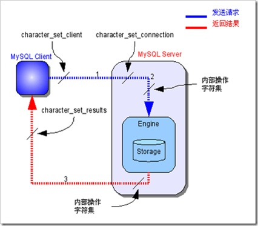

# Information_schema

information_schema数据库是MySQL系统自带的数据库，它提供了数据库元数据的访问方式. information_schema就像是MySQL实例的一个百科全书，记录了数据库当中大部分我们需要了结的信息，比如字符集，权限相关，数据库实体对象信息，外检约束，分区，压缩表，表信息，索引信息，参数，优化，锁和事物等等。通过information_schema我们可以窥透整个MySQL实例的运行情况，可以了结MySQL实例的基本信息，甚至优化调优，维护数据库等.

## 关于字符集和排序规则相关的系统表

* CHARACTER_SETS: 存储数据库相关字符集信息
* COLLATIONS: 排序规则表
* COLLATION_CHARACTER_SET_APPLICABILITY: 字符集和其校对的对应关系表

与字符集相关的变量:

* character_set_server: 默认的内部操作字符集
* character_set_system: 系统元数据(字段名等)字符集
* character_set_database: 数据库默认字符集. 如果不设置, 默认的字符集同 character_set_system .
* character_set_clietn: 客户端使用的字符集
* character_set_connection: 客户端连接时字符集
* character_set_results: 查询结果字符集
* character_set_filesystem: 把os上文件名转化成此字符集，即把 character_set_client转换character_set_filesystem，默认binary是不做任何转换的

character_set_client、character_set_connection、character_set_results这3个参数值是由客户端每次连接进来设置的，和服务器端的设置仅作为默认值。

## 字符集转换过程

1. MySQL Server收到请求时将请求数据从character_set_client转换为character_set_connection；

2. 进行内部操作前将请求数据从character_set_connection转换为内部操作字符集，其确定方法如下：

    * 使用每个数据字段的CHARACTER SET设定值；

    * 若上述值不存在，则使用对应数据表的DEFAULT CHARACTER SET设定值(MySQL扩展，非SQL标准)；

    * 若上述值不存在，则使用对应数据库的DEFAULT CHARACTER SET设定值；

    * 若上述值不存在，则使用character_set_server设定值。

3. 将操作结果从内部操作字符集转换为character_set_results。

