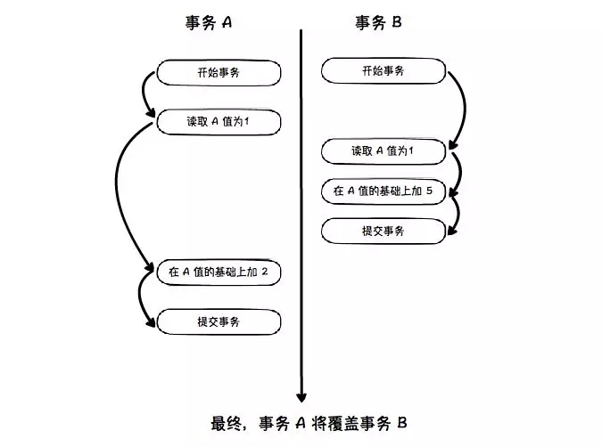

# Transaction

## 术语

* 脏读(Dirty Read): 一个事务可以读取到其他事务未提交的数据.
* 不可重复读(Unrepeatable Read): 同一个事务, 两次执行同一条查询语句, 得到不同的结果. 一般地, 关注数据的修改, 即两次读取的值不同, 而不是记录行数不同.
* 幻读( Phantom Read): 是不可重复读的一种特例. 关注记录行数变化(新增, 删除). 在一个事务中，第一次查询某条记录，查询不到，但是，当试图更新这条不存在的记录时，竟然能成功，并且，再次读取同一条记录，它就神奇地出现了.

## 事务

### Isolation - 事务隔离级别

ANSI SQL STANDARD定义了4类隔离级别, 按隔离级别**由低到高**排列

* READ_UNCOMMITTED: 可以读取其他事务**未提交**的数据. 隔离级别最低, 并发性能最好. 会脏读.
* READ_COMMITTED: 读取**已提交**的数据. 会出现不可重复读(关注修改), 幻读(关注新增,删除).
* REPEATABLE_READ: 会出现覆盖更新的情况. 见下面的"覆盖更新"图片.
* SERIALIZABLE: 所有事务都串行化. 隔离级别最高, 并发性能最差.

 

对于相同的隔离级别，不同的数据库有着自己不同的实现方式。所以我们在理解隔离级别的时候需要针对具体的数据库。

``` sql
-- 查看隔离级别
show [global] variables like '%isolation%';
-- or
select @@global.tx_isolation,@@tx_isolation;

-- 修改 session 隔离级别
set session tx_isolation='read-committed';
-- 修改全局隔离级别
set global tx_isolation='read-committed';

-- 查看自动提交
show variable like 'autocommit';
-- 关闭自动提交
set autocommit=off;
-- 开启事务(begin/start transaction) 会 disable autocommit, 直到事务结束(commit/rollback), autocommit 设置为事务开始前的值(With START TRANSACTION, autocommit remains disabled until you end the transaction with COMMIT or ROLLBACK. The autocommit mode then reverts to its previous state. ).
-- 推荐启用 set autocommit=on + begin + commit/rollback
```

### 实现方式

* READ_UNCOMMITTED: 没有视图概念, 直接返回记录的最新值(Innodb buffer pool 内存中的值)
* READ_COMMITTED: 在每个 SQL 执行时数据库里创建一个视图(read-view). 数据是当前时间点前已经提交的事务修改的数据的最新值.
* REPEATABLE_READ: 在事务开启后的第一个 DML 语句执行时创建的视图, 整个事务存在期间都用这个视图. "即可读" 语句会更新该视图.
* SERIALIZABLE: 直接加锁方式避免事务并行.

## Innodb

### Innodb 事务

默认的是 REPEATABLE_READ 级别. 通过 set [global | session] transaction isolation level repeatable read; 语句可以更改隔离级别.

Innodb 在REPEATABLE_READ 级别下产生幻读的原因是前面的UPDATE语句执行之后，会将当前记录上存储的事务信息更新为当前的事务，而当前事务所做的任何更新，对本事务所有SELECT查询都变的可见，因此最后输出的结果是UPDATE执行后更新的所有记录

**事务开始时间**: 并非是从执行BEGIN语句位置开始，而是从其后开始执行的第一条语句开始分配事务ID. 而且不管什么语句, 是否成功. 可以使用 "start transaction with consistent snapshot" 指定在 start transaction 开始作为事务开始的时间点.

快照读：读取的是快照版本，也就是历史版本。普通的SELECT就是快照读.
当前读：读取的是最新版本。UPDATE、DELETE、INSERT、SELECT …  LOCK IN SHARE MODE、SELECT … FOR UPDATE是当前读。

Innodb 一致性非锁定读 ( consistent Nonlocking read ): 简称一致性读. 也称快照读. 是一种非严格意义上的 MVCC (多版本并发控制)实现. **在不同的隔离级别下, 一致性非锁定读的表现不一样**. 在 Repeatable Read 级别下快照建立的时间点是第一条select语句执行的时间点. 同一事务中, 当前读会更新当前事务使用快照的版本. 在 Read Commited 级别下, 它总是读取行的最新版本, 如果行被锁定, 则读取最新的快照.

### Innodb 的锁

InnoDB实现了两种标准的行级锁:

* 共享锁( S Lock ), 允许事务读取一行.
* 排他锁( X Lock ), 允许事务删除或更新一行数据

type | X | S
--- | --- | ---
X | 不兼容 | 不兼容
S | 不兼容 | 兼容

InnoDB支持多粒度锁定, 这种锁允许事务在行级别和表级别同时存在.
为了支持不同粒度上加锁操作, Innodb支持称为意向锁的锁方式. 意向锁是表级别的锁. 有两种意向锁:

* 意向共享锁(IS Lock): 事务想要获得一张表中某几行的共享锁
* 意向排他锁(IX Lock): 事务想要获得一张表中某几行的排他锁

意向锁是表级别的, 只会和表级别的 S Lock, X Lock 冲突, 不会和行级别的 S Lock, X Lock 冲突.
表级别的锁和意向锁的兼容性如下.

type | IS | IX | S | X
--- | --- | --- | --- | ---
IS | 兼容 | 兼容 | 兼容 | 不兼容
IX | 兼容 | 兼容 | 不兼容 | 不兼容
S | 兼容 | 不兼容 | 兼容 | 不兼容
X | 不兼容 | 不兼容 | 不兼容 | 不兼容

想要在行级上锁(细粒度锁)先要在表级加意向锁(粗粒度锁). 比如: 想在某行上 X Lock, 那么先判断能否在表上加 IX Lock. 如果无法加 IX Lock, 则等待IX Lock释放.

### Innodb 锁状态查询

用户可以通过查询 INFOMATION_SCHEMA 库中的表来查询事务和锁状态信息.

table | 描述
--- | ---
INNODB_TRX | 查看事务信息
INNODB_LOCKS | 查看锁信息
INNODB_LOCK_WAITS | 查看锁等待信息

INNODB_TRX 表字段及含义

field | 含义
--- | ---
trx_id | Innodb内部唯一的事务ID
trx_state | 当前事务的状态
trx_started | 事务的开始时间
trx_request_lock_id | 等待事务的锁ID. 如果trx_state的状态为LOCK WAIT,那么该字段代表当前事务等待之前事务占用的锁资源ID
trx_wait_started | 事务开始等待时间
trx_weight | 事务的权重, 反映了一个事务修改和锁住的行数, 当发生死锁需要回滚时, 会选择该数值最小的事务进行回滚.
trx_mysql_thread_id | 线程ID. 同 show processlist 内的线程ID.
trx_query | 事务运行的 SQL 语句

``` sql
-- 查询持续时间超过 60 秒的事务
select * from information_schema.innodb_trx where TIME_TO_SEC(timediff(now(),trx_started))>60;
```

INNODB_TRX 表只能显示当前运行的 Innodb 事务, 并不能直接判断锁的情况. 锁的具体信息需要查看 INNODB_LOCKS.
INNODB_LOCKS 这张表并不会显示所有锁的信息，而是只显示要申请却没有申请到，和已经持有锁并且阻塞其他线程的锁信息。
SELECT * FROM information_schema.INNODB_LOCKS\G;

field | 含义
--- | ---
lock_id | 锁ID
lock_trx_id | 事务ID
lock_mode | 锁的模式
lock_type | 锁的类型, 表锁还是行锁
lock_table | 加锁的表
lock_index | 锁住的索引
lock_space | 锁住的 space id
lock_page | 事务锁定页的数量, 若是表锁, 则该值为NULL
lock_rec | 事务锁定行的数量, 若是表锁, 则该值为NULL
lock_data | 被锁的数据

INNODB_LOCK_WAITS 可以直观反应事务等待情况. SELECT * FROM information_schema.INNODB_LOCK_WAITS\G;

field | 含义
--- | ---
requesting_trx_id | 申请锁资源的事务ID
requesting_lock_id | 申请的锁的ID
blocking_trx_id | 阻塞的事务ID
blocking_lock_id | 阻塞的锁的ID

#### Innodb 三种行锁算法

* Record Lock: 锁定单行记录.
* Gap Lock: 间隙锁. 锁定一个范围, 但不包括记录本身. GAP锁的目的，是为了防止同一事务的两次当前读，出现幻读的情况。
* Next-Key Lock: 行锁+间隙锁. 锁定一个范围, 包括记录本身.

不加lock inshare mode之类的快照读就使用mvcc。否则, 当前读使用next-key。mvcc的优势是不加锁，并发性高。缺点是不是实时数据。next-key的优势是获取实时数据，但是需要加锁。

默认的, Innodb 采用行锁, 前提是要有明确的索引, 否则退化为表锁. 行锁情况下, 默认锁等待时间 innodb_lock_wait_timeout = 50 s. 如果设置了 innodb_rollback_on_timeout=1, 即在超时时回滚事务. Mariadb 5.5 之前默认启用, 之后默认不启用.
在 REPEATABLE-READ 级别，事务持有的每个锁在整个事务期间一直被持有。
在 READ-COMMITED 级别，事务里面特定语句结束之后，不匹配该sql语句扫描条件的锁，会被释放。

在RR级别下，快照读是通过MVCC(多版本控制)和undo log来实现的，当前读是通过加record lock(记录锁)和gap lock(间隙锁)来实现的。innoDB 每个聚集索引都有 4 个隐藏字段，分别是主键（RowID），最近更改的事务 ID（MVCC 核心），Undo Log 的指针（隔离核心），索引删除标记（当删除时，不会立即删除，而是打标记，然后异步删除）；

## 参考

1. [自己动手实践理解数据库REPEATABLE_READ&&Next-KeyLock](https://www.cnblogs.com/songwenjie/p/8643684.html)
2. [MySQL探秘(六):InnoDB一致性非锁定读](https://juejin.im/post/5bf168aae51d453b8e54442c)
3. [MySQL探秘(五):InnoDB锁的类型和状态查询](https://mp.weixin.qq.com/s?__biz=MzU2MDYwMDMzNQ==&mid=2247483694&idx=1&sn=671ad369f67441c7d1572110066d5695&chksm=fc04c54ecb734c58101f8ff020914f4cccaf6660742a6723b431066ca05d5e71365dfd8d4556&scene=21#wechat_redirect)
