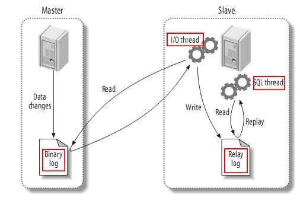
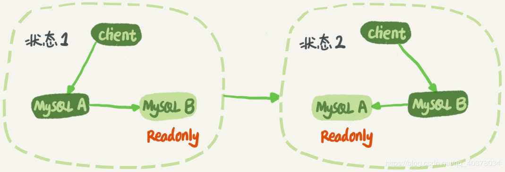
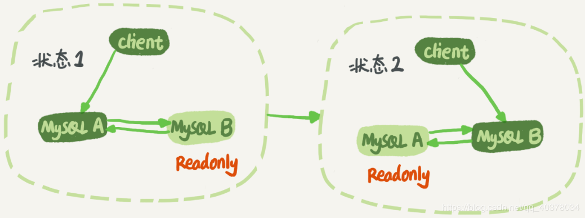
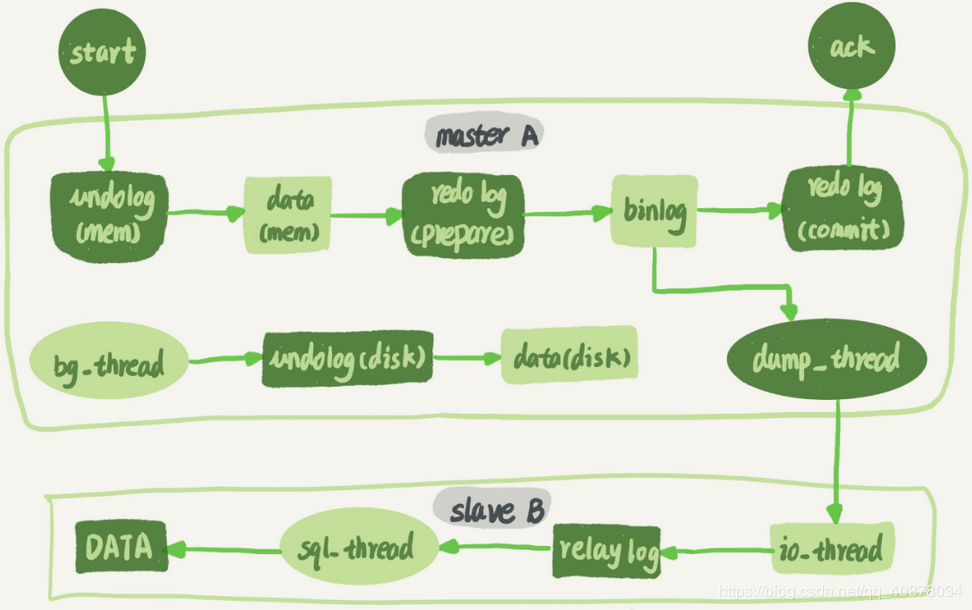

# mariadb 主从复制

[mariadb replication](https://mariadb.com/kb/en/standard-replication/) 是一种高可用的方法.

## 基本原理

master 负责推送 binlog 给 slave.

## 常见结构

### 主从结构

### 主主结构

#### 解决循环复制问题

1. 两个 master 的 server id 一定不相同. 

2. slave 在接收到 binlog 保存为 relay log, 然后 sql thread 重放过程中, 生成与原 binlog 的 server id 相同的新的 binlog. 
3. 每个库收到自己的 master 发来的 binlog 后, 先判断 server id, 如果和自己的相同, 表示这个日志是自己生成的, 则跳过.

双主结构日志的执行流程:

1. 从 A 更新的事务, binlog 里记录的都是 A 的 server id.
2. 传递给 B 后, B 生成的 binlog 里也是 A 的 server id.
3. 再传回给 A , A 判断日志中 server id 和自己的一样, 就不会处理这个日志.

## 基本原理

### 复制过程图

## 基于 binlog 文件位置的复制

优点: 配置简单

缺点: 

## 基于 GTID 的复制

