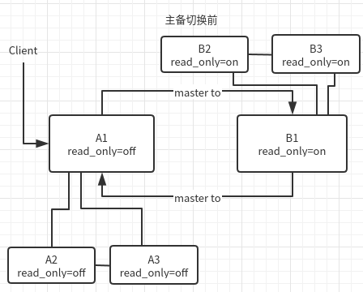

# 两个 mariadb 节点间复制

以下基于 mariadb 10.3 验证. 参考[官方文档](https://mariadb.com/kb/en/setting-up-a-replication-slave-with-mariabackup/).

前置条件:

1. 主机中安装 mariabackup 工具. [安装方法](../tools/installing-tools.md).
2. 主机 sudo 权限 或者 mysql user(容器内 mysql 用户:组 -- mysql:mysql . uid:gid -- 999:999).
3. 数据库 root 或者 有 REPLICATION SLAVE 权限的 user.
4. 第一个节点到第二个节点免密访问.

以下例子中第一个节点叫 A (192.168.150.24), 第二个节点叫 B (192.168.150.21).

为了模拟生产环境, 初始状态下, A 启动, B 未启动. 

2个集群采用 ansible [安装](#ansible方式). 

## 结构图



## 主从模式

mariadb 10.3 已经默认启用 gtid_mode. 生产环境中的配置已经满足主从模式要求.

结构图中无 B1 master to A1.

A, B 节点必需的配置项.

``` ini
# server_id 用于区分 master 和 slave. 
# A 的 server_id 一定不等于 B 的 server_id
# 当前使用版本mariadb 10.3.4. N 取值 [1, 2**32) .  
server_id=N

# binlog 存放路径. 
# 可以省略路径. 此时, 需要配置 datadir (数据存放目录) 和 log_basename(binlog, slowlog, errorlog, pid 等文件的基础文件名). 
log_bin[=name]

# 数据文件的基础文件名
log_basename=mariadb
```

备份 A 节点数据

``` shell
# 登录 A
# 进入 mariadb 容器
# 建立备份目录
mkdir -p /var/lib/mysql/backup/fullbackup
# 备份数据.
# --target-dir 指明备份数据存放目录
mariabackup --backup \
	--target-dir=/var/lib/mysql/backup/fullbackup \
	--user=root --password=root_pwd
	
# 准备
mariabackup --prepare --target-dir=/var/lib/mysql/backup/fullbackup

# 拷贝准备好的备份数据到 B. 需要先做 A 到 B 的 ssh 免密.
rsync -avrP /var/lib/mysql/backup/fullbackup/ 192.168.150.21:/backup
```

部署 B 节点

假设第二个节点部署在 /app/midserv/mariadb_repl 目录. 数据目录为 /mount_data/mariadb_repl/data.

``` shell
# 登录 B
# 拷贝备份数据到数据目录
mariabackup --copy-back  --datadir=/mount_data/mariadb_repl/data \
	--target-dir=/backup
	
# 修改数据目录权限. 因容器中 mysql:mysql 的 uid:gid 为 999:999
sudo chown -R 999:999 /mount_data/mariadb_repl/data

# 检查配置 server_id . 一定要不等于 A 的 server_id.
server_id=M

# 进入部署目录
cd /app/midserv/mariadb_repl
# 启动
docker-compose up -d

# 查看 master status
mysql -u root -proot_pwd -h 192.168.150.24 -e 'show master status;'
# 假设输出
# File	Position	Binlog_Do_DB	Binlog_Ignore_DB
# mysql-bin.000018	2418

# 设置 B 的 master 为 A
# 并检查结果
mysql -u root -p -h 192.168.150.21 << EOF
change master to master_host="192.168.150.24", master_user="repl", master_password="password", master_log_file="mysql-bin.000018", master_log_pos=2418;
start slave;
show slave status\G;
EOF

# 结果中出现以下,表示正常
# Slave_IO_Running               | Yes
# Slave_SQL_Running              | Yes
# Seconds_Behind_Master 表示同步时间延后 master 的秒数. 0 表示同步.
# Seconds_Behind_Master          | 0

# 设置第二个节点 B 为只读
mysql -u root -p -h 192.168.150.21 -e 'set global read_only=on;'
```


## 主主模式

在主从模式的基础上进行设置, 形成主主模式.

``` shell
# 查看第二个节点(B)的 master 状态
mysql -u root -p -h 192.168.150.21 -e 'show master status;'
# 假设输出
# File	Position	Binlog_Do_DB	Binlog_Ignore_DB
# mysql-bin.000004	96

# 设置 A 的  master 为 B
# 并检查结果
mysql -u root -p -h 192.168.150.24 << EOF
change master to master_host="192.168.150.21", master_user="repl", master_password="password", master_log_file="mysql-bin.000004", master_log_pos=96;
start slave;
show slave status\G;
EOF

# 结果中出现以下,表示正常
# Slave_IO_Running               | Yes
# Slave_SQL_Running              | Yes
# Seconds_Behind_Master 表示同步时间延后 master 的秒数. 0 表示同步.
# Seconds_Behind_Master          | 0
```

## 集群安装

### ansible方式

解压 [test_ansible.zip](./test_ansible.zip). 修改文件中的 ip 指向正确的主机. 

说明: 

1. mariadb 集群对应主从模式或主主模式中的 A 集群. mariadb_repl 集群对应主从模式或主主模式中的 B 集群.
2. 集群最小节点数量为 2. 比如: mariadb_repl .

相关命令参见 playbooks/mariadb_readme.md 和 playbooks/mariadb_repl_readme.md.