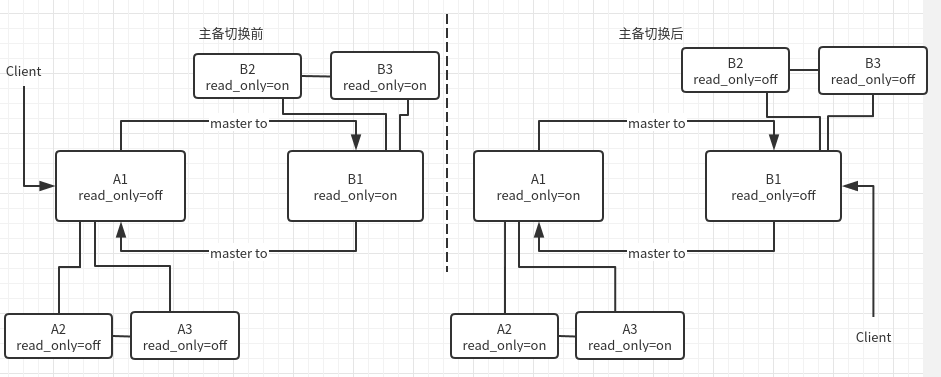

# 主从切换

## 集群方式

集群部署方法参考[两个-Galera-集群间复制](./两个-Galera-集群间复制.md).

以下例子中集群 1 (3个节点) 简称 A, ip 为 192.168.150.24~3, 集群 2 (3个节点) 简称 B, ip 为 192.168.150.21~3 . 端口都是默认的 3306. A 为 master, B 为 slave. 

### 双主结构示意图



### 双主结构切换过程

为了保证数据一致性. 采用可靠性优先原则.

步骤:

1. 如果集群 A 前面有 Nginx 则在 Nginx 下线 A 集群所有节点.

1. 检查 B1 slave 状态中同步进度落后 A1 的时间 (Seconds_Behind_Master, 单位: 秒). 如果小于 5 (单位: 秒), 则进入下一步, 否则等待, 继续检查.

``` shell 
# 检查 slave 状态
mysql -uroot -p -h 192.168.150.21 -e 'show slave status\G;'
# 结果中 Slave_IO_Running, Slave_SQL_Running 显示 slave 运行状态, 全为 Yes 表示正常. Seconds_Behind_Master: 0 表示同步时间延后 master 的秒数. 0 表示同步.
# 
# Slave_IO_Running: Yes                                                                                            
# Slave_SQL_Running: Yes
# Seconds_Behind_Master: 0 表示同步时间延后 master 的秒数. 0 表示同步.
```

1. 将集群 A 中所有节点设置为 read_only=ON. 

``` shell
# 
ansible-playbook pb_dba_set_check_read_only.yml -e mdb_hosts=mariadb -e read_only=ON
# 部分结果
# ok: [n1.mariadb.nfcos] => {
#    "check_result.stdout_lines": [
#        "Variable_name\tValue", 
#        "read_only\tON"
#    ]
# }

```

1. 检查 B1 中同步进度落后 A1 的时间 (单位: 秒). 如果等于 0 (单位: 秒), 则进入下一步, 否则等待, 继续检查.
2. 将集群 B 中所有节点设置为 read_only=OFF.

``` shell
# 
ansible-playbook pb_dba_set_check_read_only.yml -e mdb_hosts=mariadb_repl -e read_only=OFF
# 部分结果
# ok: [n1.mariadb_repl.nfcos] => {
#    "check_result.stdout_lines": [
#        "Variable_name\tValue", 
#        "read_only\tOFF"
#    ]
# }
```


1. 将业务请求切换到集群 B. 
2. 检查 A1 中 slave 状态.

``` shell
# 检查 slave 状态
mysql -uroot -p -h 192.168.150.24 -e 'show slave status\G;'
```


